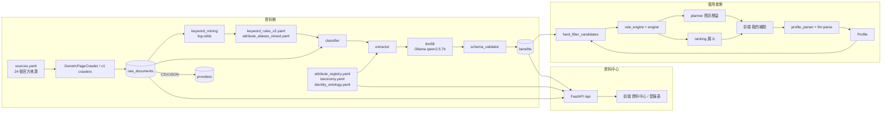

# 系統架構（v2）

## 元件責任

| 元件 | 責任 | 不負責 |
| --- | --- | --- |
| 關鍵字統計 | 從語料算出篩選／分類詞 | 判資格 |
| 分類器 | 是否補助、類別 | 條件抽取 |
| Extractor | 給付特徵、條件句 → 登錄表規則 | 猜測原文沒寫的值 |
| 本地 AI | 填空缺欄位、對不到屬性的條件句、複雜條件判斷、使用者描述 | 覆蓋規則式證據、自創條件 |
| Validator | 摘錄／屬性／型態／數值檢查 | — |
| Rule Engine | 逐條判斷（unknown 不拒絕） | 排序 |
| Planner | 下一題（資訊增益） | 措辭（前端） |
| Ranking | 漏斗與適合度 | 資格 |

## 執行環境

- backend：FastAPI（uvicorn），MongoDB（pymongo），可選 Redis（背景工作佇列）。
- crawler-worker：`python -m benefit_crawler --loop`，同一份程式碼。
- Ollama：安裝在主機，容器透過 `host.docker.internal:11434` 連線；不可用時系統退回純規則式。
- frontend：Vite build → nginx 靜態檔，`/api` 反向代理到 backend。
