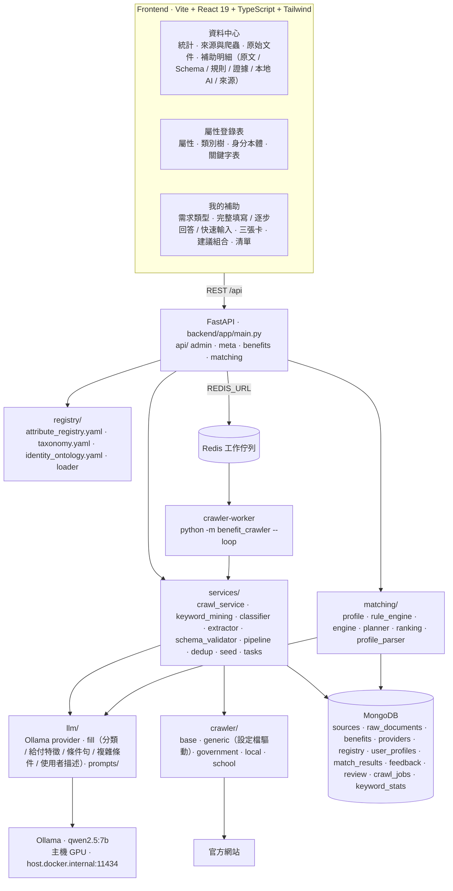

# 系統架構圖（v2）

```mermaid
flowchart TB

subgraph FE[Frontend · Vite + React 19 + TypeScript + Tailwind]
  A1[資料中心<br/>統計 · 來源與爬蟲 · 原始文件 · 補助明細（原文 / Schema / 規則 / 證據 / 本地 AI / 來源）]
  A2[屬性登錄表<br/>屬性 · 類別樹 · 身分本體 · 關鍵字表]
  A3[我的補助<br/>需求類型 · 完整填寫 / 逐步回答 / 快速輸入 · 三張卡 · 建議組合 · 清單]
end

FE -->|REST /api| API[FastAPI · backend/app/main.py<br/>api/ admin · meta · benefits · matching]

API --> SVC[services/<br/>crawl_service · keyword_mining · classifier · extractor · schema_validator · pipeline · dedup · seed · tasks]
API --> MT[matching/<br/>profile · rule_engine · engine · planner · ranking · profile_parser]
API --> REG[registry/<br/>attribute_registry.yaml · taxonomy.yaml · identity_ontology.yaml · loader]
SVC --> LLM[llm/<br/>Ollama provider · fill（分類 / 給付特徵 / 條件句 / 複雜條件 / 使用者描述）· prompts/]
MT --> LLM
SVC --> CRAWL[crawler/<br/>base · generic（設定檔驅動）· government · local · school]
SVC --> DB[(MongoDB<br/>sources · raw_documents · benefits · providers · registry · user_profiles · match_results · feedback · review · crawl_jobs · keyword_stats)]
MT --> DB
LLM --> OL[Ollama · qwen2.5:7b<br/>主機 GPU · host.docker.internal:11434]
CRAWL --> WEB[官方網站]
WK[crawler-worker<br/>python -m benefit_crawler --loop] --> SVC
API -->|REDIS_URL| RQ[(Redis 工作佇列)]
RQ --> WK
```
