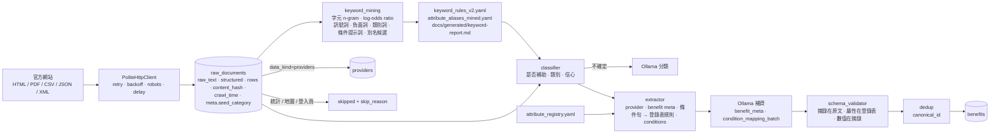

# 資料流程圖（Data Pipeline，v2）

```mermaid
flowchart LR

W[官方網站<br/>HTML / PDF / CSV / JSON / XML] --> R[PoliteHttpClient<br/>retry · backoff · robots · delay]
R --> RD[(raw_documents<br/>raw_text · structured · rows · content_hash · crawl_time · meta.seed_category)]
RD --> KM[keyword_mining<br/>字元 n-gram · log-odds ratio<br/>訊號詞 · 負面詞 · 類別詞 · 條件提示詞 · 別名候選]
KM --> KR[keyword_rules_v2.yaml<br/>attribute_aliases_mined.yaml<br/>docs/generated/keyword-report.md]
KR --> CL[classifier<br/>是否補助 · 類別 · 信心]
RD --> CL
CL -->|不確定| AI1[Ollama 分類]
CL --> EX[extractor<br/>provider · benefit meta · 條件句 → 登錄表規則 · conditions]
REG[attribute_registry.yaml] --> EX
EX --> AI2[Ollama 補齊<br/>benefit_meta · condition_mapping_batch]
AI2 --> VA[schema_validator<br/>摘錄在原文 · 屬性在登錄表 · 數值在摘錄]
VA --> DD[dedup<br/>canonical_id]
DD --> DB[(benefits)]
RD -->|data_kind=providers| PV[(providers)]
RD -->|統計 / 地圖 / 登入頁| SK[skipped + skip_reason]
```

每一階段的輸入輸出見 [../pipeline-spec.md](../pipeline-spec.md)。
