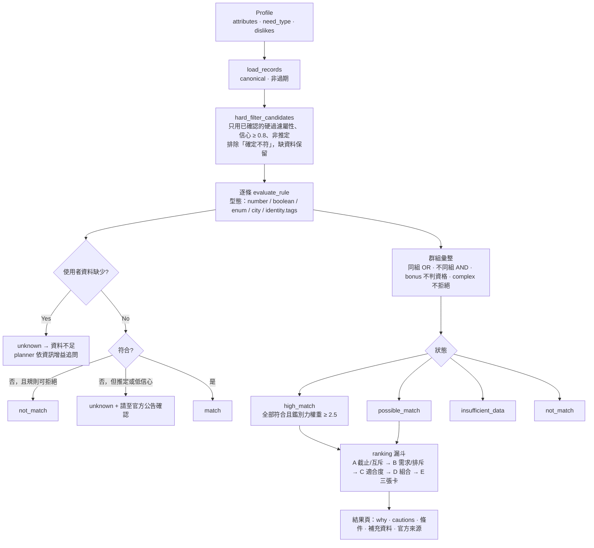

# 資格判斷流程圖（Eligibility Flow，v2）

```mermaid
flowchart TD

A[Profile<br/>attributes · need_type · dislikes] --> B[load_records<br/>canonical · 非過期]
B --> C[hard_filter_candidates<br/>只用已確認的硬過濾屬性、信心 ≥ 0.8、非推定<br/>排除「確定不符」，缺資料保留]
C --> D[逐條 evaluate_rule<br/>型態：number / boolean / enum / city / identity.tags]
D --> E{使用者資料缺少?}
E -->|Yes| F[unknown → 資料不足<br/>planner 依資訊增益追問]
E -->|No| G{符合?}
G -->|否，且規則可拒絕| H[not_match]
G -->|否，但推定或低信心| I[unknown + 請至官方公告確認]
G -->|是| J[match]
D --> K[群組彙整<br/>同組 OR · 不同組 AND · bonus 不判資格 · complex 不拒絕]
K --> S{狀態}
S --> S1[high_match<br/>全部符合且鑑別力權重 ≥ 2.5]
S --> S2[possible_match]
S --> S3[insufficient_data]
S --> S4[not_match]
S1 --> RK[ranking 漏斗<br/>A 截止/互斥 → B 需求/排斥 → C 適合度 → D 組合 → E 三張卡]
S2 --> RK
RK --> UI[結果頁：why · cautions · 條件 · 補充資料 · 官方來源]
```
