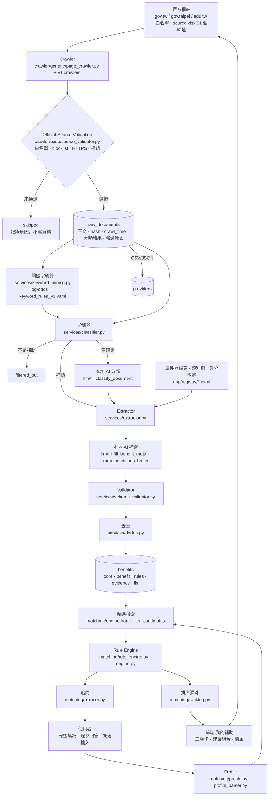

# 系統總流程圖（v2）

從官方網站到推薦結果、再回到官方來源的完整路徑。每個節點都對應實際模組（括號內為程式位置）。

```mermaid
flowchart TD

A[官方網站<br/>gov.tw / gov.taipei / edu.tw 白名單 · source.xlsx 51 個網址] --> B[Crawler<br/>crawler/generic/page_crawler.py + v1 crawlers]
B --> V{Official Source Validation<br/>crawler/base/source_validator.py<br/>白名單 · blocklist · HTTPS · 標題}
V -->|未通過| X[skipped<br/>記錄原因，不寫資料]
V -->|通過| C[(raw_documents<br/>原文 · hash · crawl_time · 分類結果 · 略過原因)]
C --> KM[關鍵字統計<br/>services/keyword_mining.py<br/>log-odds → keyword_rules_v2.yaml]
KM --> CL[分類器<br/>services/classifier.py]
C --> CL
CL -->|不是補助| F[filtered_out]
CL -->|不確定| L1[本地 AI 分類<br/>llm/fill.classify_document]
CL -->|補助| E[Extractor<br/>services/extractor.py]
L1 --> E
R[屬性登錄表 · 類別樹 · 身分本體<br/>app/registry/*.yaml] --> E
E --> L2[本地 AI 補齊<br/>llm/fill.fill_benefit_meta · map_conditions_batch]
L2 --> VA[Validator<br/>services/schema_validator.py]
VA --> D[去重<br/>services/dedup.py]
D --> M[(benefits<br/>core · benefit · rules · evidence · llm)]
C -->|CSV/JSON| P[(providers)]

U[使用者<br/>完整填寫 · 逐步回答 · 快速輸入] --> PP[Profile<br/>matching/profile.py · profile_parser.py]
PP --> HF[候選檢索<br/>matching/engine.hard_filter_candidates]
M --> HF
HF --> RE[Rule Engine<br/>matching/rule_engine.py · engine.py]
RE --> Q[追問<br/>matching/planner.py]
Q --> U
RE --> RK[排序漏斗<br/>matching/ranking.py]
RK --> UI[前端 我的補助<br/>三張卡 · 建議組合 · 清單]
UI --> A
```
