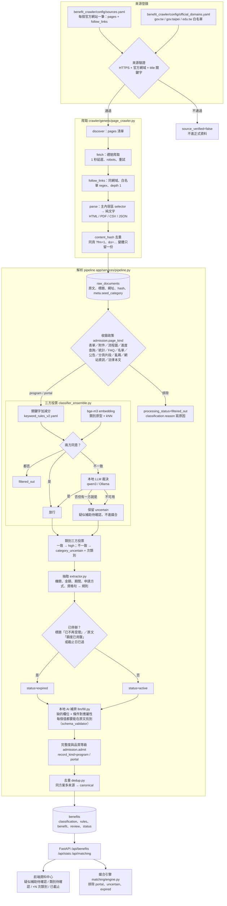
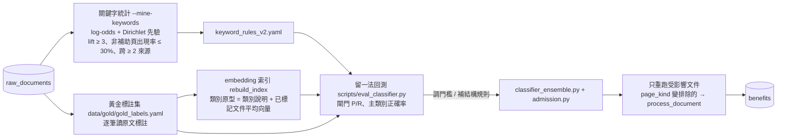
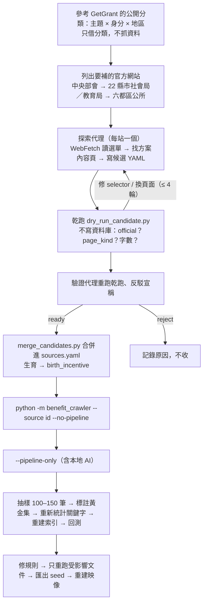

# 資料流程圖（來源 → 爬取 → 收錄 → 分類 → 抽取 → 補齊 → 媒合）

本文件是 [pipeline-spec.md](pipeline-spec.md) 的圖解版；每一格都對應到程式模組。最後一節列出這輪擴充來源時遇到的問題與解法。

現況（2026-09-13，第三輪擴充＋逐筆稽核後）：官方來源 49 個（本輪 +25，48 個通過來源驗證）、原始文件 1,592 份、
補助紀錄 1,226 筆（去重後代表紀錄 930：方案 867、彙整頁 63；重複紀錄 296 筆保留但不顯示）。
方案的欄位狀態：欄位完整 649、缺資格或金額待確認 218、疑似補助待確認 11、主類別待確認 63、已截止 18、有可直接比對的資格規則 779。

規則式稽核 867 筆：完全沒有旗標 607 筆（70.0%）；確定性錯誤 0 筆（稽核前為 510 筆、693 筆次）。
其餘旗標都是原文本來就沒寫（無金額 177、原文過短 19、沒有可比對的資格條件 47）或刻意標記的待確認（類別 63、是否補助 11）。

黃金標註集 300 筆，留一法回測：閘門（是不是補助）三方投票 precision 0.935 / recall 1.000（0 漏抓、16 筆誤放行，其中 9 筆已標待確認）；
主類別正確率 0.822、算到次類別 0.902（只用關鍵字 0.724／0.804，只用 embedding 0.832／0.916）。

## 1. 主流程

## 2. 校正迴圈（資料變多之後怎麼提高正確率）

## 3. 新增來源的流程（本輪）

## 4. 問題與解法（本輪）

每一項：現象 → 原因 → 解法 → 驗證。

### 4.1 爬取

| # | 現象 | 原因 | 解法 | 驗證 |
| --- | --- | --- | --- | --- |
| 1 | 桃園市社會局偶爾回傳 HTTP 200 但只有選單、沒有 `#CCMS_Content` 的空殼頁，內文抓不到 | 站台間歇性回應不完整 | `GenericPageCrawler.fetch`：頁面沒有任何設定的主內容區時（`looks_like_shell`）等 2 秒重抓一次 | `tests/test_page_crawler_split.py::test_looks_like_shell_only_when_configured_selectors_missing`；乾跑同一頁不再出現 0 字 |
| 2 | 板橋區公所追連結抓到的文件標題是「20250415-02.pdf(開啟新視窗)」 | `_collect_links` 優先拿 `<a title>`，而該站的 title 屬性是檔名 | `anchor_label`：以看得到的連結文字為主，檔名或「(開啟新視窗)」不當標題 → 解析時改用頁面自己的標題 | `test_anchor_label_ignores_filenames_and_window_notes` |
| 3 | 社家署 `www.sfaa.gov.tw` 憑證缺 Subject Key Identifier，Python 3.13 預設驗證失敗 | 站方憑證欄位不完整 | 既有設定 `ssl_strict_x509=false` 的 SSL context 可正常抓；不需改碼，記錄下來 | 乾跑 16/16 成功 |
| 4 | 方案全文在附件 PDF，HTML 頁只有附件清單（社家署、新北市社會局、衛福部社會救助司） | 機關把要點放附件 | `pages` 直接登錄 PDF（`format: pdf` + `source_page` 記來源頁）；只收對民眾有給付內容的 PDF | 乾跑 kind=program、字數 ≥ 300 |
| 5 | 方案內文在別的主機（新北市在 `service.ntpc.gov.tw` 申辦 E 服務、衛福部附件在 `www.mohw.gov.tw/dl-…`） | 機關網站與內容系統分離 | `pages` 可以跨主機（都要是官方網域）；`follow_links` 仍只追同主機 | 乾跑 official=True |
| 6 | 新北育兒資訊網 `lovebaby.sw.ntpc.gov.tw` 是單頁應用（#/ 路由），伺服器只回空殼 | 內容由 JavaScript 載入 | 標 `skip: true` 並記原因；改收社會局／E 服務的對應頁 | 乾跑 0 字 → skip |
| 7 | 社家署 PDF 網址帶 token（`?f=…&g=…`） | 下載連結由站方產生 | 先照抓（多次觀察 token 固定）；`source_page` 記來源頁，失效時可重取 | 乾跑成功；之後爬蟲失敗會顯示在來源狀態 |
| 8 | 掃描影像 PDF（115 年最低生活費公告）抽不出文字；板橋區公所 PDF 是問答表格，文字順序略亂 | pypdf 只抽文字層 | 影像 PDF 不收（同數字已在其他文件）；表格 PDF 仍收，資格與金額都在，抽取以句子為單位不受順序影響 | 乾跑字數；欄位審核 |
| 9 | 區公所網站多半只連到市府社會局的方案頁，自己沒有內文（臺北市大安區） | 六都的方案由市府統一 | 區公所只收真的寫出資格與給付的頁面；其餘由市府來源涵蓋，重複的由 dedup 併為同一方案 | 乾跑 program 頁數；dedup 報表 |
| 10 | 桃園市社會局沒有生育／育兒／托育頁 | 桃園這些業務由其他機關承辦 | 另找承辦機關來源（下一批） | — |
| 11 | 幼兒園就學補助在 `www.ece.moe.edu.tw`（edu.tw 不在白名單） | edu.tw 需逐站白名單 | `official_domains.yaml` 加 `www.ece.moe.edu.tw`（教育部國教署）與 `www.bli.gov.tw`（勞保局） | `--list` 顯示 ✅ |
| 12 | 生育獎勵金沒有專屬類別，關鍵字分類器把「高雄市生育津貼」歸到就業／身障 | 登錄表缺類別、語料裡沒有正例 | taxonomy 新增 `birth_incentive`；合併來源時把標題含「生育」的頁 seed_category 改為它；爬完後重新統計關鍵字、重建 embedding 索引 | 回測主類別正確率 |
| 13 | 生育獎勵金／生育津貼多半由民政局（戶政）受理，不在社會局網站（臺南、新竹市、基隆、苗栗） | 業務分屬不同機關 | `pages` 可逐頁寫 `organization` 覆寫主辦機關（`GenericPageCrawler.discover`），把民政頁放進同一縣市來源 | 乾跑：臺南 1,357 字、新竹市 697 字，kind=program |
| 14 | 雲林縣社會處整個 `*.yunlin.gov.tw` 在 Cloudflare WAF 後面，非瀏覽器一律 403；robots.txt 也明確禁止 AI 爬蟲 | 站方政策 | 不收、不繞過（尊重 robots）；雲林的方案改由其他官方來源（我的E政府彙整、中央部會）涵蓋 | `--list` 不登錄 |
| 15 | 猜的網址不存在或轉址（基隆 social.klcg → www.klcg.gov.tw/tw/social/、苗栗 → www.miaoli.gov.tw/social_affairs/、臺南 → sab.tainan.gov.tw、三民區 → smd.kcg.gov.tw、東區 → www.tneast.gov.tw） | 各縣市網站架構不同 | 探索代理用 WebSearch／WebFetch 確認實際網址並記在 issues；`base_url` 用最終網址 | 乾跑 official=True |
| 16 | 南投縣社會福利資訊網的方案內文由 JavaScript POST 載入，靜態 HTML 只有標題 | 前端動態載入 | 改收各方案頁的實施計畫／要點 PDF（`FileDownload.ashx`，`format: pdf`） | 乾跑 30 份 PDF ≥ 300 字 |
| 17 | 勞保局把每項給付拆成「請領資格／給付標準／請領手續」三頁 | 網站結構 | 先以「方案名 — 段落名」各收一份；同方案多份靠 dedup 的標題前綴合併，未合併的在資料中心可看出 | dedup 報表 |
| 18 | 臺中西屯區、高雄三民區公所沒有寫出資格與給付的頁面（只有 FAQ 或職掌表） | 區公所只列業務名稱 | 不收；六都區公所只在真的有內文時登錄（板橋 PDF 問答、中壢附件 PDF、大安 PDF） | 乾跑 program ≥ 300 字 < 3 → reject |

### 4.2 收錄、分類與抽取（試點 256 份文件跑完後檢視）

| # | 現象 | 原因 | 解法 | 驗證 |
| --- | --- | --- | --- | --- |
| 19 | 「老人經濟補助總覽」「托育福利業務總覽」等目錄頁被標成「疑似補助待確認」或被過濾掉 | 彙整頁也進了三方投票：關鍵字與 embedding 無意見時交 LLM，LLM 只有一票 → uncertain；兩方都否 → filtered_out | `classify_ensemble`：`page_kind=portal` 直接保留為 portal（不投票、不呼叫 LLM、不進清單與媒合） | `test_portal_pages_are_kept_as_portal_without_voting`；回填後 uncertain 的總覽頁歸零 |
| 20 | 被三方投票排除的文件 `classification.reason` 空白、`page_kind` 一律 program | 排除分支沒把 decision_basis 寫進 reason，EnsembleResult 寫死 program | 帶入 `ens.decision_basis` 與結構性 kind | `test_rejected_page_keeps_its_structural_kind` |
| 21 | 25 筆的主辦機關只剩「社會局」 | 頁面「發布單位：社會局」是科室簡稱，抽取時優先用它 | 來源登錄的完整機關名以它結尾時改用完整名，摘錄仍是原文的「發布單位：社會局」 | `test_department_shorthand_uses_full_source_organization`；回填 25 筆 |
| 22 | 247 筆被註記「原文未找到申請截止日期」 | 社會救助類多為隨時受理，用語（隨時申請、無申請期限…）不在規則裡 | `ROLLING_RE` 補齊用語 → `application_period.rolling=True`，不再註記缺截止日 | `test_rolling_phrases_set_rolling_period`；回填 |
| 23 | 健保費／國民年金保費補助落在「醫療費用補助」或「身心障礙其他福利」；早療補助、好孕專車、坐月子服務類別待確認 | 登錄表沒有對應類別，類別說明缺這些方案名 | 新增 `insurance_premium_subsidy`；`birth_incentive`／`disability_care_subsidy`／`medical_subsidy` 說明補上常見方案名（embedding 原型會用） | 重建索引後回測 |
| 24 | 關鍵字分類器把「基隆市生育獎勵金」「高雄市生育津貼」判成獎學金／就業 | 語料裡沒有生育類正例 | 黃金集新增 150 筆（含生育頁）並讓關鍵字統計優先採用黃金標籤（`keyword_mining.load_corpus`），重新統計 | 重新統計後 `keyword_rules_v2.yaml` 有 birth_incentive 詞表 |
| 25 | 同一方案在多個分類頁重複張貼（花蓮、臺南）、勞保局一個給付拆三頁 | 站方結構 | 探索代理把重複頁標 skip 或放 deny；標題以「請領手續／申請程序」結尾的那頁判為 fragment（資格與給付頁仍收）；剩餘由 dedup 併為同一方案 | `test_fragments_garbled_text_and_audit_pages_are_excluded`；dedup_changed 63（試點） |
| 26 | 「澎湖縣弱勢兒童及少年醫療補助審查核發作業規定」被判為行政公告 | notice 規則的「查核」命中了「審查核發」的一部分 | 查核／督導要成詞才算（`(?<!審)查核…`、`督導(?!員)`） | 同上測試 |
| 27 | 「歷史沿革」「政府網站開放資料宣告」「標售得標價」「低收入戶三項生活補助費調整公告」被放行 | 這些種類的字眼不在規則裡 | site_info 補歷史沿革／開放資料宣告／資訊安全政策；statistics 補得標價／標售；notice 補調整公告 | 300 筆回測的誤放行清單少 4 筆 |
| 28 | 600 多份文件逐份呼叫本地 AI 補齊欄位，一輪要十幾小時 | pipeline 在抽取後對每份文件都做 AI 補齊，連之後會被去重的重複紀錄也做 | 新增 `--no-fill`：本地 AI 只用在分類投票，欄位補齊改用 `--llm-fill`（只補 canonical） | `python -m benefit_crawler --pipeline-only --no-fill` |
| 29 | 146 筆的主辦機關是科室名（社會救助科、婦幼發展及平權科） | 頁面「發布單位」放承辦科室 | 發布單位以科／課／組／室／中心結尾又沒有機關名詞時改用來源登錄的機關名（`is_division_name`），摘錄仍是原文 | `test_department_shorthand_uses_full_source_organization`；`scratchpad/backfill_providers.py` 回填 146 筆 |
| 30 | 本地 AI 補齊了欄位，品質等級仍停在 needs_review | `llm_fill_pending` 寫回時沒有重算 `admission.admit` | 補齊後寫回前重算完整度／品質等級／record_kind | `scratchpad/refresh_admission_all.py` 全庫重算：36 筆 needs_review → verified |

## 5. 逐筆稽核（每一筆補助的類別與 schema 內容）

分兩層做，兩層都留下可重跑的腳本與報告：

**規則式全庫掃描**（`backend/scripts/audit_records.py`，不呼叫 LLM，45 項確定性檢查）
證據摘錄是否逐字出自原文、金額數字是否出現在原文、金額是否其實是收入／財產門檻或自付額、
數字後面接的是不是量詞（1副、1,000點、2,400cc 這種不是錢）、標題與主類別是否衝突、
主辦機關是否為科室或聯絡資訊、規則城市是否有原文佐證、必要條件是否互斥而永遠比對不上、
狀態與截止日是否衝突、收錄政策是否已改判、完整度與品質等級是否相符、綱要驗證是否通過、
是否有同名同機關的重複代表紀錄。輸出 `docs/generated/record-audit-after.md`（逐筆清單）與 `.json`。

**代理逐筆讀原文**（`backend/scripts/export_audit_packets.py` 把每筆的欄位現況＋原文輸出成批次檔，
代理依 `audit_brief.md` 的判準逐筆比對，另一個代理逐項反駁；沒有原文逐字引文的指控一律駁回）。
修正前跑過兩輪、共 868 筆，修正後再抽 175 筆（每個來源輪流取樣）複查。
輸出 `docs/generated/record-audit-agents.md` 系列。

### 5.0 稽核前後（規則式全庫掃描，同一套檢查）

| 指標 | 稽核前 | 修正後 |
| --- | ---: | ---: |
| 掃描的方案紀錄 | 866 | 867 |
| 完全沒有旗標 | 214（24.7%） | 607（70.0%） |
| 有確定性錯誤的紀錄 | 510（58.9%） | 0 |
| 確定性錯誤總筆次 | 693 | 0 |
| ├ 綱要驗證移除欄位（值在原文找不到） | 401 | 0 |
| ├ 義務條款不是原文逐字 | 83 | 0 |
| ├ 規則缺值 | 62 | 0 |
| ├ 主辦機關是科室名或聯絡資訊 | 63 | 0 |
| ├ 金額數字不在原文 | 48 | 0 |
| └ 其他（地區、標題與類別衝突、規則城市、門檻金額…） | 36 | 0 |
| 必要條件互斥、永遠比對不上（另一支腳本量） | 23.0% | 0% |

最後三個旗標（rolling 與截止日並存、金額像舊年度、標為已截止卻找不到依據）是**稽核腳本自己誤判**：
逐筆讀原文後確認資料是對的（「受理期間 1/1–12/31，採隨到隨辦」、「112年4月1日以後所生發給三萬元」是生效日、
「自114年2月1日起停止新增補助對象」就是停辦依據），因此改的是判準而不是資料，並在此註明。

剩下的 317 筆旗標全部是「原文本來就沒寫」或「刻意標記待人工確認」：
現金給付但原文沒寫金額 177（抽查其中原文真的有金額的只有 1 筆，已修）、主類別待確認 63、
沒有可直接比對的資格規則 47（多為長照服務說明頁）、原文過短 19、是否補助待確認 11。
### 5.0b 代理逐筆讀原文（三輪）

| 輪次 | 稽核筆數 | 回報問題 | 每筆平均 | 驗證確認／駁回 | 最常見型態 |
| --- | ---: | ---: | ---: | --- | --- |
| 第一輪（修正前） | 441 | 1,913 | 4.3 | 1,853／17 | 擇一條件被寫成必要條件 |
| 第二輪（第一批修正後） | 427 | 1,787 | 4.2 | 1,716／32 | 擇一條件被寫成必要條件 497 |
| 第三輪（重抽＋補齊後，每個來源輪流取樣 175 筆） | 175 | 648 | 3.7 | 627／21 | 擇一條件被寫成必要條件 136 |

三輪都指向同一個最大問題：**「符合下列之一」的條列被讀成必須同時成立**。
前兩輪的修法（把互斥的必要條件併成擇一）治標而且修過頭——老人與身心障礙可以同時成立，併成擇一等於放寬資格。
第三輪才找到真正的成因並逐一修掉：條列層級沒有概念（#54）、擇一項目裡的細節被當成全案條件（#55）、
否定詞的作用範圍太短（#56）、排除句抓到方案自己的受益身分（#57）、財產門檻被讀成自有住宅（#58）、
公文把「一」打成注音「ㄧ」（#59）。這些修法完成後做了最後一次全量重抽與補齊。

第三輪的問題分布：資格規則 241（嚴重 153）、金額 131、申請期間 103、申請方式 77、該不該收錄 36、
適用對象 24、類別 22、主辦機關 14。其中 98 項是「原文本來就沒寫」，不是抽錯。
### 5.1 稽核抓到、已修好的系統性錯誤

| # | 問題 | 影響 | 修法 |
| --- | --- | --- | --- |
| 31 | 「符合下列之一」的條列資格被寫成必須同時成立 | 約三成方案的必要條件互斥（同時要是低收入戶又是中低收入戶、同時年滿65又年滿55），媒合時永遠比對不上 | 條列 OR 群組只收身分型條件；收尾時自動把互斥的必要條件併成擇一群組（`relax_contradictory_rules`），並用 `scripts/check_unsatisfiable_rules.py` 量測 |
| 32 | 「無自有住宅」被抽成「有自有住宅」 | 資格方向相反，排除掉真正符合的人 | 否定詞緊接屬性、以及別名本身是否定寫法時都要反轉 |
| 33 | 「公私立大專校院」被讀成「限私立」 | 排除所有公立學校學生 | 只有「限公立／私立為限」才產生限制規則 |
| 34 | 收入門檻漏抽（「低於新臺幣一百萬元」） | 資格規則少了最關鍵的一條 | 限定詞與數字之間允許夾幣別 |
| 35 | 大寫與異體數字（壹貳參、仟佰）、跨行數字、「2萬7,000」「1千5百」 | 金額少算一位數或完全抓不到 | 補齊數字表、接回被斷行切開的數字、支援連續位數與「億」 |
| 36 | 表格或無標點段落裡的金額抓不到 | 假牙、意外救助、托育等整張金額表落空 | 視窗式回退（金額前後 40 字要有給付語氣，自付額與門檻不算） |
| 37 | 自付額、收入門檻、預算總額被當成給付金額 | 顯示的金額與實際補助無關 | 子句層級的門檻判斷、排除 1 億以上的預算數字 |
| 38 | 佔位規則掛在段落標題上（「三、申請期限：」變成年齡條件） | 3,000 多條無意義規則，媒合時全變成「資料不足」 | 佔位規則要真的是條件、屬性要真的被摘錄提到 |
| 39 | 主辦機關寫成科室名或聯絡電話 | 200 筆的機關欄位無法辨識 | 科室名與聯絡資訊一律改用來源登錄的機關名 |
| 40 | 鄰近縣市被當成戶籍限制 | 例如新北市生育獎勵金要求同時設籍新北與基隆 | 機關轄區已知時，只寫別的縣市的子句不產生戶籍規則 |
| 41 | 應備文件抓到段落標題、受理單位、電話 | 文件清單不可用 | 文件必須像文件（有文件名詞、不以冒號結尾） |
| 42 | 申請方式欄位常空白 | 民眾最需要的一句不見了 | 直接抓原文的「申請方式／申辦方式」段落 |
| 43 | 相對期限（「死亡之日起一年內」）被當成沒有期限 | 誤報「原文未找到申請截止日」 | 相對期限視為隨時受理並保留原文敘述 |
| 44 | 「自114年2月1日起停止新增補助對象」仍顯示受理中 | 民眾白跑 | 停辦字眼擴充，補齊後重算狀態 |
| 45 | 民國年被當成期間長度（民國90年 → 設籍1080個月） | 資格條件荒謬 | 年份寫法不計入期間 |
| 46 | 本地 AI 改寫的義務條款看起來像原文 | 違反「不造假」原則 | 義務條款只收原文逐字，改寫的一律換成它引用的原文 |
| 47 | 補齊後沒有重算完整度與狀態 | 補到金額或截止日的紀錄仍標「待補」或「受理中」 | 補齊寫回前重算 |
| 48 | 金額正規表示式在長數字串上指數爆炸 | 一份 3 萬字的給付基準表（長照給付支付基準）讓解析卡住十分鐘以上，稽核腳本與任何整頁解析都會停住 | 重複段一定要吃掉一個位數字（十百千），消除 `(A+B?)+` 的歧義；2,280 條含金額子句的解析結果與舊版完全相同，全庫解析時間從卡死變成 0.3 秒 |
| 49 | 數量詞被當成金額（「每人以1副」→ 1 元、「1,000點」、「2,400cc」） | 民眾看到的金額完全不對 | 金額數字在摘錄裡每次出現後面若都接非金錢量詞就不採用（`number_is_counted`），本地 AI 補齊與稽核共用；已清掉 4 筆 |
| 50 | 中文數字被 PDF 斷行切成兩行（「每坪新臺幣二」＋「百元」） | 句子切割後只剩「百元」，200 元變成 100 元 | 前一行以中文數字結尾、下一行以位數字開頭時接回；全庫 17 份文件受影響，已重抽 |
| 51 | 本地 AI 憑空指定戶籍縣市（「設籍本市」→ 臺北市，其實是桃園市的方案） | 民眾被判定不符合資格 | 戶籍縣市規則的每個縣市都必須逐字出現在摘錄裡；補成機關轄區的 10 條改標為「依機關推定」並寫明依據，其餘 6 條刪除 |
| 52 | 互斥身分清單開太寬，把「老人＋身心障礙」「老人＋原住民」也當成擇一 | 兩條各自必要的身分條件被併成擇一，等於放寬資格（只要是老人就符合） | 互斥清單只留低收／中低收／一般戶經濟困難；已併的 272 筆用原文證據重判：引用不同條列項的維持擇一，其餘拆回各自條件，來源是內文某一句、原文沒說是「同時」還是「擇一」的 296 條標為需語意判斷（媒合時不直接判不符合） |
| 53 | 條列式資格的引導句只認「之一／任一／符合下列」 | 「…失能者，包含：一、65歲以上老人。二、領有身心障礙證明者。」被讀成必須同時成立 | 引導句樣式加上「對象／資格／條件…包含／包括／如下／分為」，應備文件與金額清單不受影響 |
| 54 | 擇一條列沒有層級概念 | 「三、符合下列身分之一：（一）…（二）…」後面的「四、已入住機構者不得申請」也被算進擇一群組 | 記住引導句自己的條列層級（一、／1.／（一）／※），回到同一層就結束擇一群組 |
| 55 | 擇一項目裡的細節被當成全案條件 | 高雄市生育津貼「二、未設籍本市…之婦女，其新生兒經生父認領登記」被抽成全案排除（戶籍不得在高雄市）與全案性別限制（限婦女），與第一條路徑的「設籍本市滿十個月」直接矛盾 | 擇一條列裡只有身分型條件是選項，其他屬性改標為需語意判斷，不當成全案條件也不當成全案排除 |
| 56 | 否定詞離屬性別名幾個字就失效 | 「兒童未接受公共化或準公共托育服務」變成「必須接受公共托育」，方向完全相反 | 否定詞＋動詞之後，只要到別名之間沒有跨子句標點就算否定；跨逗號則不推定（寧可不寫） |
| 57 | 排除句抓到方案自己的受益身分 | 榮民子女獎助學金產生「排除身分：榮民子女」，學雜費減免產生「排除身分：身心障礙」 | 標題裡就有的身分不產生排除規則 |
| 58 | 財產門檻被讀成「必須有自有住宅」 | 低收入戶方案的「土地及房屋價值合計未超過450萬元」變成 housing.owns_property = true，把無自有住宅的申請人全擋掉 | 門檻子句不產生布林屬性規則（金額門檻仍由數值規則處理） |
| 59 | 公文把「一」打成注音「ㄧ」 | 「符合下列情形之ㄧ」沒被認出是擇一條列，三條擇一資格變成必須同時成立 | 比對用正規化與抽取器讀入的原文都把「ㄧ」換成「一」 |
| 60 | 同一筆同時主張互相矛盾的兩件事 | 戶籍必須在高雄市又排除戶籍在高雄市；身分必須是榮民子女又排除榮民子女 | 收尾時比對：排除規則與必要規則衝突就刪排除；同一個布林屬性同時要 True 與 False 時兩條都改標為需語意判斷 |
| 61 | 「有下列情形者不得申請：」的排除語氣往後蓋太多條 | 榮民子女獎助學金的「具清寒家庭子女證明者為優先獎助對象」被繼承成排除低收入戶、中低收入戶、清寒家庭 | 遇到新的段落標題就停止繼承；句子本身是優先／加分語氣也不繼承 |
| 62 | 優先順序被當成資格條件 | 「為優先獎助對象」因為同句有「限於設定名額」而被當成必要條件，等於要求申請人一定要是低收入戶 | 「為優先…」「優先獎助／錄取／入園」這類寫法一律視為加分，不看同句其他限定詞 |

### 5.2 稽核後仍存在、需要人工或後續處理的

- **原文本身沒有的欄位**（最大宗，不是抽取錯誤）：177 筆現金給付的頁面沒寫金額。抽查其中原文真的有金額的只有 1 筆（已修），
  其餘不是只寫補助比例（「補助 80%」）就是只寫自付額門檻。欄位維持空白並標「待補」。
- **沒有可直接比對的資格條件** 47 筆：長照服務說明頁（資格寫在流程敘述裡）與表格式頁面（例如「高雄市第3胎以上鼓勵生育措施」整頁是一張名稱／內容／權管機關的表，資格寫在表格欄位裡），句子切不出來就抽不到條件。
- **主類別待確認** 63 筆：三方投票不一致時保留候選類別為次類別，前台標示待確認。
  這一群裡確實混有判錯的（「耐震弱層補強」被歸到學雜費減免），但正因為投票不一致才會被標出來，不會以確定的姿態顯示給民眾。
- **列表頁編號黏在標題上**：3 筆長照公告的標題變成「4在臺…」「16公告…」「8公告…」。
  只影響顯示，暫未自動裁切以免誤傷「115年度…」這類正常標題。
- **級距與條件的語意**：金額級距缺標籤、把某一給付項目的附屬條件當成全案條件、把被照顧者年齡當成申請人年齡。
  這類要逐筆讀原文才判得出來，代理稽核會抓到但沒有通用修法。
- **跨頁方案**：勞保局把一項給付拆成資格／標準／手續三頁，目前仍是三筆紀錄。
